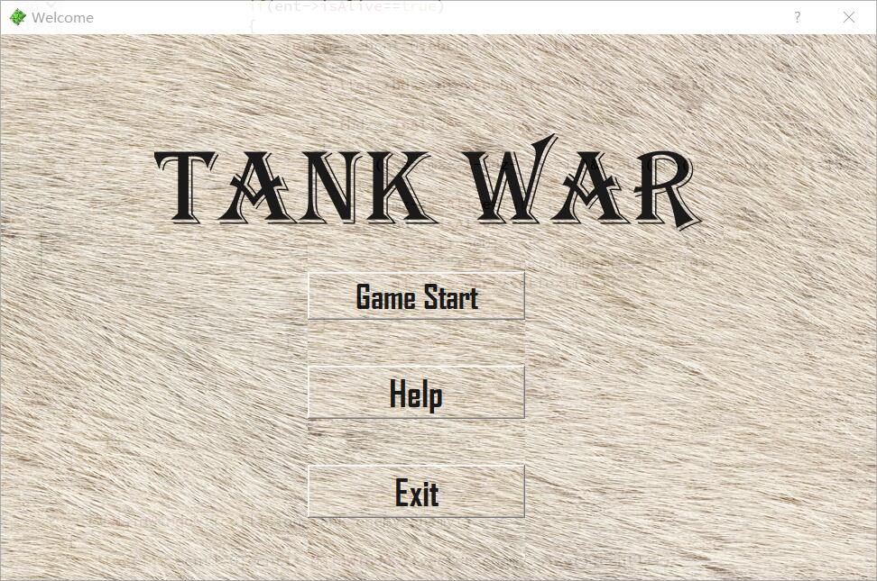
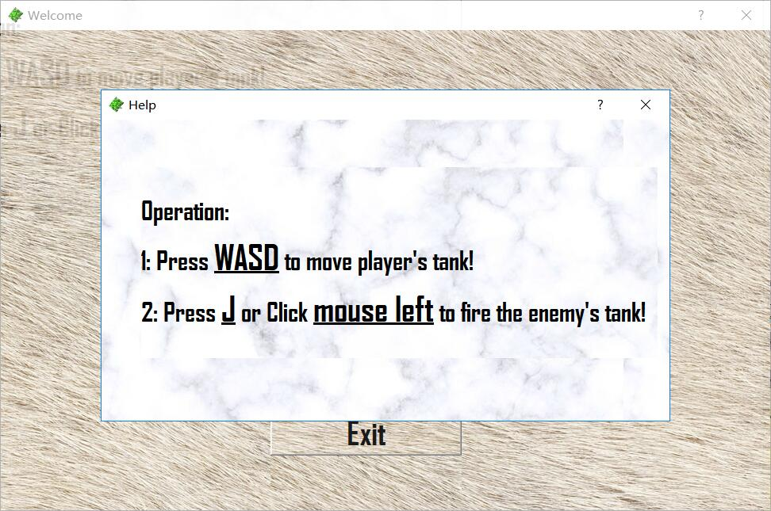
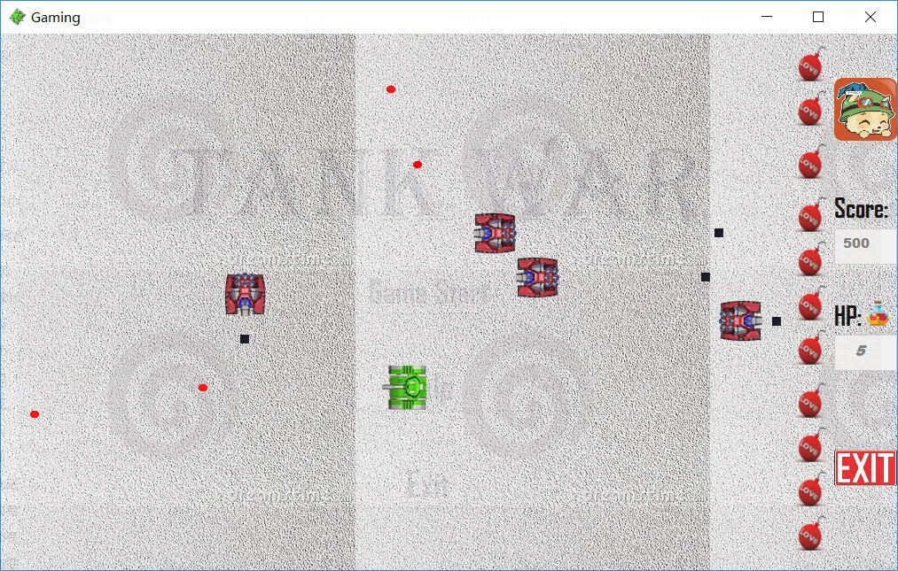
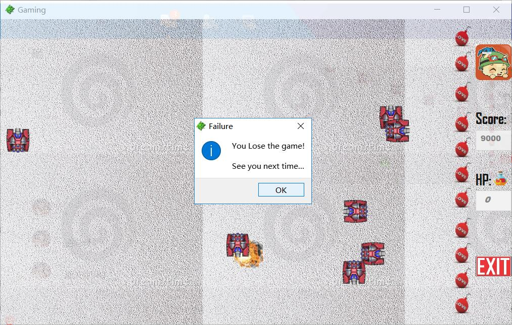

# 设计说明

本程序基于 C++ & Qt 5.9 完成了一个坦克大战的设计，单人玩家控制1个主坦克，可以发射子弹、自由移动。

胜利条件是击败在场的所有敌方坦克。

失败条件是我方血量被耗尽。

操作按键：上下左右对应 WSAD，射击键为 J，或者鼠标左键

# 界面展示

## 欢迎界面



## 按键帮助



## 游戏进行



## 游戏失败



## 游戏胜利

因为胜利条件太苛刻，我就成功了一次，但没有截图。

根据我写的条件来看，游戏前期比较有希望赢，到后面坦克不断生产越来越难。

可以视作坦克版飞机大战无尽版...

# 文件结构

```
子弹类
Bullet.h/cpp

坦克类
Tank.h/cpp
PlayerTank.h/cpp
EnemyTank.h/cpp

窗口对话框类
mainwindow.h/cpp
dialog.h/cpp
dialog1.h/cpp

图片文件
blood.png
Bomb_1.png
Bomb_2.png
boom.png
Bullet.png
eBullet.png
EnemyTank_D.png
EnemyTank_L.png
EnemyTank_R.png
EnemyTank_U.png
exit.jpg
gamemap2.jpg
help_background.jpg
Life.png
MyTank_D.png
MyTank_L.png
MyTank_R.png
MyTank_U.png
Time.png
timo.jpg
welcome_background.jpg
```

# 各个类的功能

## 坦克类

```C++
class Tank
{
public:
    Tank();
    void fire();
public:
    int x;          // 纵坐标
    int y;          // 横坐标
    int dir;        // 坦克的方向
    int speed;      // 坦克的速度
    int hp;         // 坦克的生命值
    bool isAlive;   // 坦克的是否还活着
};
```

主要功能：提供基类

## 玩家坦克类

```C++
class MyTank : public QObject, public Tank
{
      Q_OBJECT
public:
    MyTank();
    ~MyTank();
    void fire();
public slots:
    void move();
public:
    Bullet *bullet;
    QVector<Bullet *> bullet_vector;
public:
    QTimer *timer;
    bool up;        // 辅助方向标记上
    bool down;      // 辅助方向标记下
    bool left;      // 辅助方向标记左
    bool right;     // 辅助方向标记右
};
```

主要功能：移动、开火

## 地方坦克类

```C++
class EnemyTank: public Tank, public QThread
{
public:
    EnemyTank();
    EnemyTank(int x, int y, int dir);
    void run();
public:
    Bullet *en_bullet;
    QVector<Bullet *> en_bullet_vector;
};
```

主要功能：移动、开火

## 子弹类

```C++
class Bullet : public QThread
{
public:
    Bullet();
    Bullet(int x,int y,int dir);
    void run();
    ~Bullet();
public:
    int x;        // 纵坐标
    int y;        // 横坐标
    int count;    // 武器子弹的数量
    int dir;      // 判断子弹的方向
    int speed;    // 子弹的速度
    bool isAlive; // 是否存活，决定是否显示
};
```

主要功能：移动、开火

## 游戏控制类

```C++
class MainWindow : public QMainWindow
{
    Q_OBJECT
public slots:
    void collision_attack_player_enemy();      // 我方子弹和敌方坦克的碰撞检测
    void collision_bullet_player_enemy();      // 我方子弹和敌方子弹的碰撞检测
    void collision_tank_enemy_enemy();         // 敌方子弹和敌方子弹的碰撞检测
    void collision_bullet_enemy_player();      // 敌方子弹和我方坦克的碰撞检测
    void create_tank_enenmy();                 // 制造敌方坦克
public:
    explicit MainWindow(QWidget *parent = 0);
    ~MainWindow();
private:
    void paintEvent(QPaintEvent *event);       // 绘图
    void keyPressEvent(QKeyEvent *);           // 键盘响应
    void keyReleaseEvent(QKeyEvent *);         // 键盘松开
    void mousePressEvent(QMouseEvent *);       // 鼠标响应
    void PaintAll(int x,int y,QString a,int target_x,int target_y,int source_x,int source_y);
public:
    MyTank  myTank;
    Bullet  bullet;
    Bullet  *bul1;
    EnemyTank enemytank;
    QVector<EnemyTank *> vector_enemy;

    QTimer *timer;
    QTimer *timeradd;

    int getx;             // 用于子弹的绘制
    int gety;
    QString str_score;    // 得分控制
    int int_score;
    QString str_life;     // 坦克生命控制
    int enemy_size;       // 敌方坦克数量
    int bullet_size;
private slots:
    void on_EXIT_clicked();
    void on_L_Request_destroyed();
private:
    Ui::MainWindow *ui;
};
```

主要功能：
1. 组织游戏的各个阶段（开始，帮助，游戏中，结束）
2. 处理各类子弹与子弹、子弹与坦克碰撞，包括
    * 玩家子弹-敌方坦克（敌方被打）
    * 敌方子弹-玩家坦克（玩家被打）
    * 敌方子弹-敌方子弹（子弹抵消）
    * 玩家子弹-敌方子弹（子弹抵消）